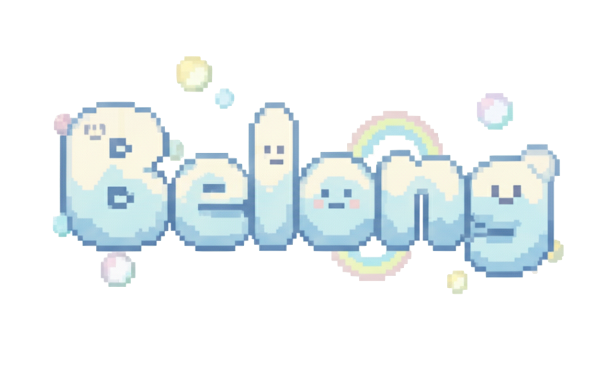

# 🎮 Belong - An Interactive Inclusion Journey



> **"Every choice shapes belonging. Step into the school day of Maya or Alex and guide their story."**

## 📖 About The Game

**Belong** is an interactive narrative game that explores high school inclusion through the perspectives of two unique students: Maya Nguyen and Alex Carter. Players make meaningful choices that impact their character's sense of belonging, confidence, and social connections throughout a week of school life.

Through pixel art aesthetics and branching storylines, players experience firsthand how small actions and inclusive behaviors can profoundly affect students who face different challenges in their school environment.

---

## 🎯 Project Overview

### Team: Runtime Terror

**Game Concept**: Educational interactive fiction focused on fostering empathy and understanding around inclusion in high schools.

**Target Audience**: Educators, students, and anyone interested in learning about inclusion through interactive storytelling.

**Core Experience**: 
- Choose between two distinct character perspectives
- Navigate 4 days of school scenarios with meaningful choices
- See how your decisions impact inclusion scores and confidence levels
- Learn insights about diversity, neurodiversity, and cultural inclusion

---

## 🌟 Features

### 🎭 Two Unique Character Paths

#### **Maya Nguyen** 🌸
- Vietnamese international student
- Faces language barriers and cultural gaps
- Loves storytelling and debate club
- Journey focuses on cultural inclusion and finding community

#### **Alex Carter** 🤖
- Autistic student passionate about robotics
- Navigates sensory overload and social communication
- Robotics whiz with a sharp mind
- Journey focuses on neurodiversity support and self-advocacy

### 🎨 Visual Design
- **Pixel Art Aesthetic**: Retro-inspired 2D graphics with modern polish
- **Custom Character Portraits**: Multiple emotional states for each character
- **Immersive Backgrounds**: Hand-crafted school environment scenes
- **Pixel Font**: Press Start 2P for authentic retro gaming feel

### 🎵 Audio
- **Background Music**: Chill lo-fi soundtrack at 50% volume
- **Seamless Integration**: Music starts when character selection begins
- **Loop Playback**: Continuous atmospheric audio throughout gameplay

### 📊 Game Mechanics
- **Branching Narratives**: 4 scenarios per character with multiple outcomes
- **Inclusion Score System**: Track your impact on character's sense of belonging (0-100)
- **Confidence Mechanics**: Some choices require minimum confidence levels
- **Flag System**: Previous choices unlock or modify future options
- **Educational Insights**: Real facts about inclusion woven into scenarios

### 💾 Save System
- **Auto-save**: Progress automatically saved to localStorage
- **Resume Capability**: Continue where you left off
- **Multiple Playthroughs**: Explore different paths and outcomes

### 📱 Responsive Design
- **Desktop Optimized**: Full-screen split-panel gameplay experience
- **Tablet Friendly**: Adaptive layouts for medium screens
- **Mobile Ready**: Vertical stacking for smaller devices

---

## 🎮 Gameplay Flow

1. **Home Screen**
   - Pixel art logo and welcoming tagline
   - Start new story or continue saved progress
   - Access educational resources

2. **Character Selection**
   - Choose between Maya or Alex
   - View character backgrounds and challenges
   - Horizontal card layout with portraits

3. **Interactive Scenarios**
   - **Split-Screen Layout**: 
     - Left panel: Character portrait, dialogue, and choice buttons
     - Right panel: Immersive background artwork
   - **Dynamic Portraits**: Character emotions change based on scenario
   - **Educational Facts**: Contextual insights about inclusion
   - **Immediate Feedback**: See how choices impact scores

4. **Results Screen**
   - Final inclusion score and tier (Isolated → Struggling → Belonging → Thriving)
   - Character reflection based on your choices
   - Review key decision moments
   - Option to replay or explore resources

5. **Resources Hub**
   - Educational links about inclusion and diversity
   - Community organizations supporting inclusive education

---

## 🛠️ Technical Implementation

### Tech Stack
- **HTML5**: Semantic structure and accessibility
- **CSS3**: Custom properties, animations, pixel-perfect styling
- **Vanilla JavaScript**: Modular ES6+ code architecture
- **localStorage API**: Client-side save system

### File Structure
```
game_app/
├── index.html              # Main game file
├── css/
│   └── style.css          # Complete styling (780+ lines)
├── js/
│   ├── characters.js      # Character definitions & metadata
│   ├── scenarios.js       # All branching scenarios (8 total)
│   ├── scoring.js         # Inclusion score calculations
│   └── game.js           # Game engine & state management
└── assets/
    └── images/
        ├── backgrounds/   # Scene backgrounds
        ├── characters/    # Character portraits (12 images)
        └── ui/           # Logo, icons, music
```

### Key Features Implementation

#### **Split-Screen Game Layout**
- Flexbox-based responsive split panel
- Left: 50% width - UI controls and text
- Right: 50% width - Background artwork display
- Seamless pixel-art rendering with `image-rendering: pixelated`

#### **Character State Management**
- Centralized game state object tracking:
  - Current character and scenario
  - Inclusion score (0-100 scale)
  - Confidence level
  - Choice history and flags
  - Completion status

#### **Dynamic Content Rendering**
- Portrait switching based on scenario emotional context
- Background image injection per scene
- Character accent color theming (Maya: pink, Alex: blue)
- Conditional choice availability based on confidence

#### **Branching Scenario System**
- 8 total scenarios (4 per character)
- Multiple outcomes per choice
- Confidence-gated decision paths
- Flag system for choice persistence
- Next scenario routing logic

---

## 🎨 Design Decisions

### Visual Style
- **Pixel Art**: Creates approachable, game-like feel that reduces heaviness of subject matter
- **Dark Theme**: Background uses `rgba(12, 18, 40, 0.65)` overlay for readable text on pixel art
- **Accent Colors**: Character-specific theming (Maya: `#ff7a82`, Alex: `#6ac1ff`)
- **Compact Layout**: Optimized spacing to reduce scrolling and focus attention

### User Experience
- **Inverted Triangle Button Layout**: Primary actions on top row, secondary below
- **Horizontal Character Cards**: Portrait beside text for better scanning
- **Hidden Background on Results**: Clean, distraction-free reflection screen
- **Auto-advancing Story**: Continue button appears after choice feedback

### Accessibility
- Semantic HTML structure with ARIA labels
- Focus-visible outlines for keyboard navigation
- High contrast text colors (`#f8f9ff` on dark backgrounds)
- Clear visual hierarchy with size and spacing

---

## 📚 Educational Content

### Scenario Topics

**Maya's Journey**:
1. **Cafeteria Introduction** - Breaking into established social groups
2. **Group Discussion** - Language barriers in class participation
3. **School Event** - Cultural identity and belonging
4. **Final Scenario** - Culmination of inclusion efforts

**Alex's Journey**:
1. **Robotics Lab** - Setting communication norms for neurodivergent students
2. **Group Planning** - Managing sensory overload in collaborative work
3. **PE Class** - Adapting physical activities for different needs
4. **School Assembly** - Creating accessible presentation environments

### Learning Outcomes
- Understanding diverse student experiences
- Recognizing barriers to inclusion
- Identifying supportive actions and allyship
- Building empathy through perspective-taking
- Learning about neurodiversity and cultural adaptation

---

## 🚀 Development Process

### Phase 1: Core Structure ✅
- Set up HTML structure with multiple screens
- Created modular JavaScript architecture
- Implemented character and scenario data models
- Built game state management system

### Phase 2: Visual Design ✅
- Integrated pixel art assets (12 character portraits, backgrounds)
- Applied Press Start 2P font for authenticity
- Created responsive CSS with custom properties
- Designed split-screen gameplay layout

### Phase 3: Mechanics & Polish ✅
- Implemented branching scenario logic
- Added save/load system with localStorage
- Created inclusion scoring and confidence mechanics
- Integrated background music at optimal volume

### Phase 4: UI/UX Refinement ✅
- Optimized homepage layout and spacing
- Redesigned character selection cards (horizontal layout)
- Improved text visibility and color contrast
- Removed background from results screen for clarity
- Adjusted button arrangements for better UX

---

## 🎯 Impact & Purpose

**Belong** aims to:
- Foster empathy for students facing inclusion challenges
- Educate players about practical allyship actions
- Demonstrate how small choices compound into belonging
- Provide a safe space to explore difficult topics through gameplay
- Inspire real-world inclusive behavior in schools

The game shows that inclusion isn't about grand gestures—it's about consistent, thoughtful actions that make students feel seen, heard, and valued.

---

## 📦 Assets

### Images
- **12 Character Portraits**: Various emotional states for Maya and Alex
- **2 Background Scenes**: School environments (classroom, outside)
- **1 Logo**: Pixel art Belong logo with drop shadow

### Audio
- **Background Music**: `chill.mp3` - Lo-fi atmospheric track
- Plays at 50% volume during gameplay
- Loops continuously for immersive experience

### Fonts
- **Press Start 2P**: Google Fonts, pixel-style retro gaming font
- Used throughout for authentic 2D game aesthetic

---

## 🔧 How to Run

1. **Open the game**:
   ```bash
   # Navigate to the game directory
   cd game_app
   
   # Open in browser (any method works)
   open index.html
   # OR use a local server for best experience
   python -m http.server 8000
   ```

2. **Play**:
   - Choose "Start new story"
   - Select Maya or Alex
   - Make choices and experience their week
   - Review your results and try different paths!

3. **Continue saved game**:
   - Button appears automatically if you have progress
   - Uses browser localStorage to persist state

---

## 🎓 Educational Resources

The game includes links to:
- Diversity and inclusion organizations
- Neurodiversity advocacy groups
- Cultural awareness resources
- Student support services

---

## 👥 Credits

**Team Runtime Terror**

**Development**: Interactive narrative game with branching scenarios
**Design**: Pixel art aesthetic with educational focus
**Writing**: Scenario creation based on real inclusion challenges
**Technical**: Vanilla JavaScript game engine with state management

---

## 📝 License & Usage

Created for educational purposes to promote inclusion and empathy in school environments.

---

## 🌈 Final Thoughts

**Belong** demonstrates that creating inclusive environments starts with understanding different perspectives. Through gameplay, we hope players gain insights they can apply in real life—whether as students, educators, or community members.

Every choice matters. Every voice deserves to be heard. Everyone belongs.

---

*Made with ❤️ for the RMIT Hackathon 2025*